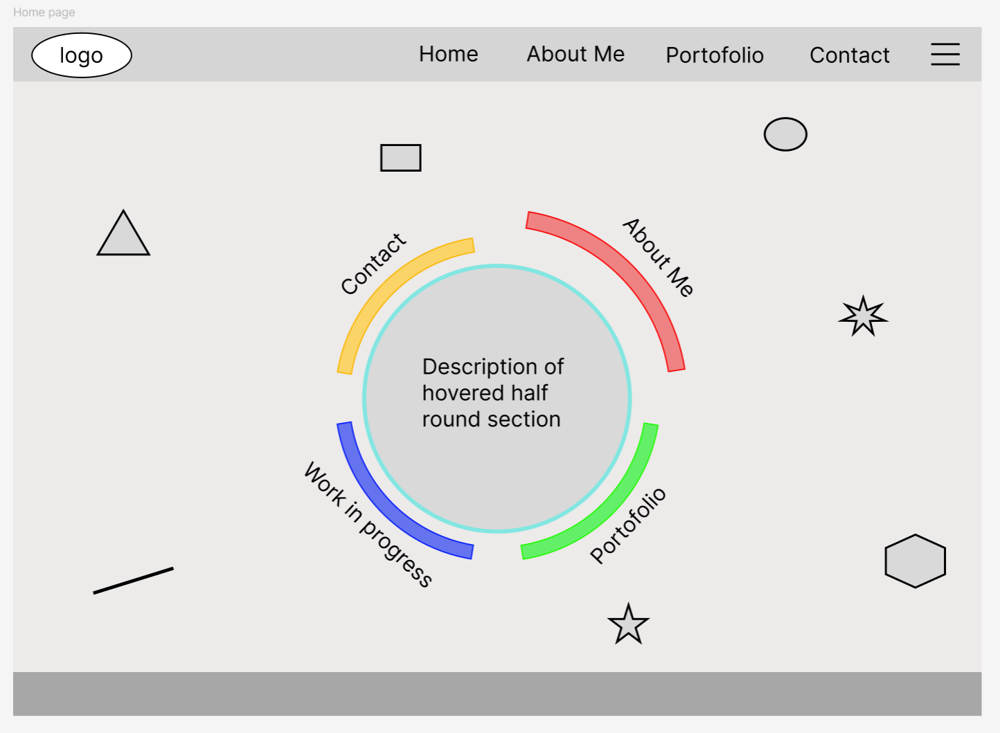

Module 1:

learn Git and GitHub (4 days)

Mini Project:

Design and plan your very first portfolio website — it doesn’t need code yet, just a well-thought structure and collaboration-ready setup.

- Create a wireframe in Figma
  
- Create a GitHub repository for your portfolio website
- Set up a Trello board with cards for each section
- Push initial files or README to GitHub
