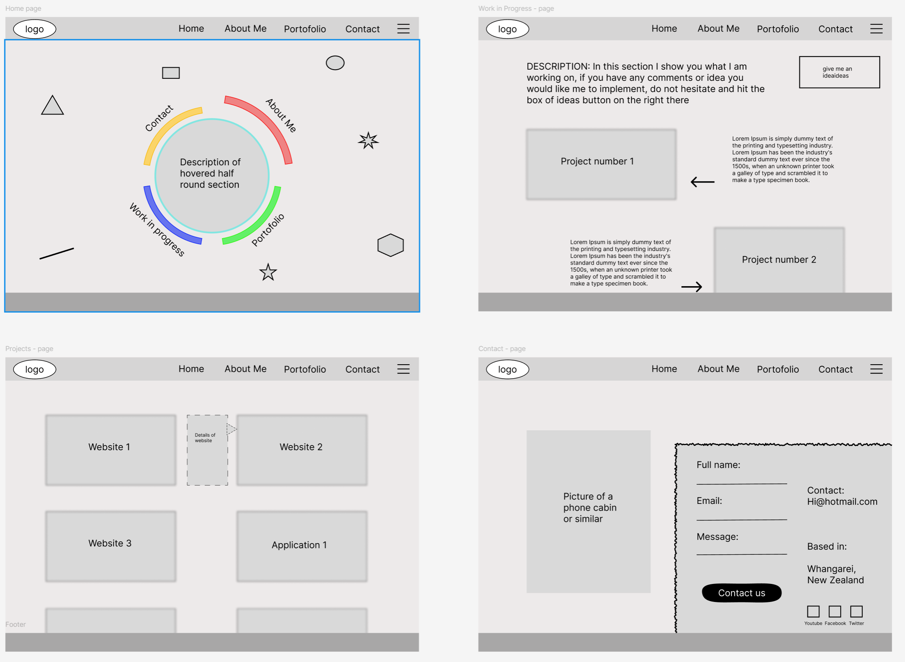
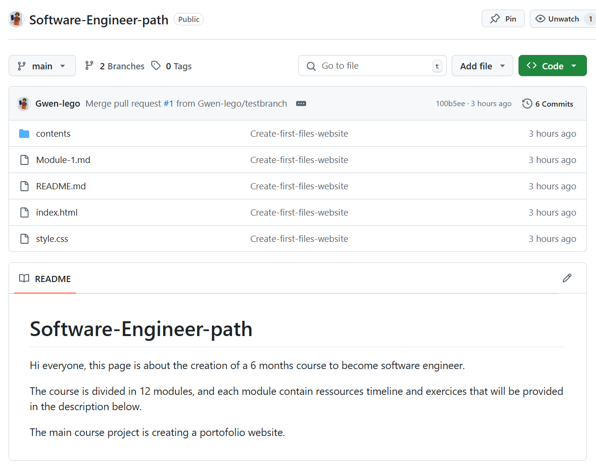
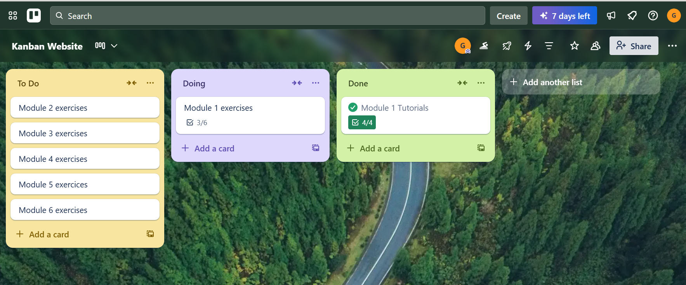

Module 1 - (2 weeks)

PROGRAM AND RESSOURCES

✅ Git & GitHub (4 days)

Basics: git init, add, commit, .gitignore, push to GitHub

Branches: branch, checkout, merge, resolve conflicts

Practice: Set up GitHub repo, commit your wireframe assets

🔗 [Udemy: Git Complete](https://www.udemy.com/course/git-complete/)

✅ Agile + Trello (3 days)

Create Kanban board

Add cards: tasks, deadlines, testing

Learn sprints & story points

🔗 [Udemy: Agile Fundamentals: Including Scrum & Kanban](https://www.udemy.com/course/agile-fundamentals-scrum-kanban-scrumban)
🔗 [Trello](https://trello.com/guide)

✅ Figma Wireframing (2 days)

Learn Figma tools, create homepage wireframe

Add About, Contact, and Projects section

Explore UI components, export PNG

🔗 [Udemy: New Figma 2024](https://www.udemy.com/course/figma-beginner)

✅ TDD Basics (2 days)

Understand Red → Green → Refactor

Write basic tests for your site layout logic

🔗 [Udemy: Javascript Unit Testing - The Practical Guide](https://www.udemy.com/course/javascript-unit-testing-the-practical-guide/?kw=javascript+unit+testing&src=sac&couponCode=ACCAGE0923)

Mini Project (3 days)

Design and plan your very first portfolio website — it doesn’t need code yet, just a well-thought structure and collaboration-ready setup.

- Create a wireframe in Figma  
  Home Page  
  
- Create a GitHub repository for your portfolio website  
- Push initial files or README to GitHub  
  
- Set up a Trello board with cards for each section  
  
